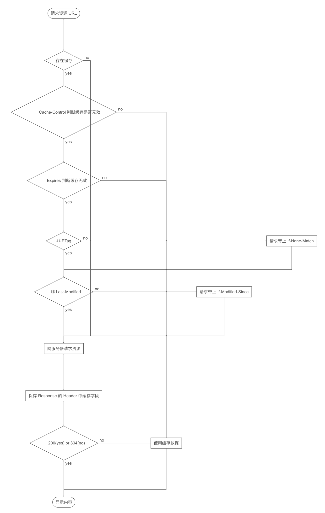

## WebView

[webClient vs webChromeClient](https://stackoverflow.com/questions/2835556/whats-the-difference-between-setwebviewclient-vs-setwebchromeclient)
webChromeClient 处理 js functions

# webView 优化

webView 加载流程： webView 初始化 (9%) -> DNS 解析及连接(55%) -> 下载 Html 页面及解析(28%) -> 加载静态资源(8%) -> Display

优化点：
静态资源缓存
HTML 预取缓存
利用 webview 初始化时间并行做一些事情

http 缓存机制

webView 缓存机制

webView 启动到页面加载完成

- [Tencent vasSonic](https://github.com/Tencent/VasSonic/blob/master/sonic-android/docs/Sonic%20Quick%E6%A8%A1%E5%BC%8F%E5%AE%9E%E7%8E%B0%E5%8E%9F%E7%90%86.md)

- [飞书 webview 优化](https://mp.weixin.qq.com/s/3t82acKigomPrqLq7-gelQ)

#### Cookie vs Session

- Http 是无状态协议，服务端需要记录用户状态时，需要某种机制来识别具体用户，这种机制就是 Session ，如购物车
  - Session 是保存在服务端的
  - 服务端保存用户信息的一种机制, Session 机制就是服务器上的客户明细表

- 通常客户端需要在 Cookie 中包含 Session Id 来证明自己身份 ，客户端保存用户信息的一种机制
  - 会话跟踪、状态管理 (登录态、购物车、游戏分数，自动填写登录信息)
  - 个性化设置 （用户设置、主题）
  - 浏览器行为跟踪 （跟踪分析用户行为）

- [Cookie 和 Session 区别](https://www.cnblogs.com/ityouknow/p/10856177.html)
